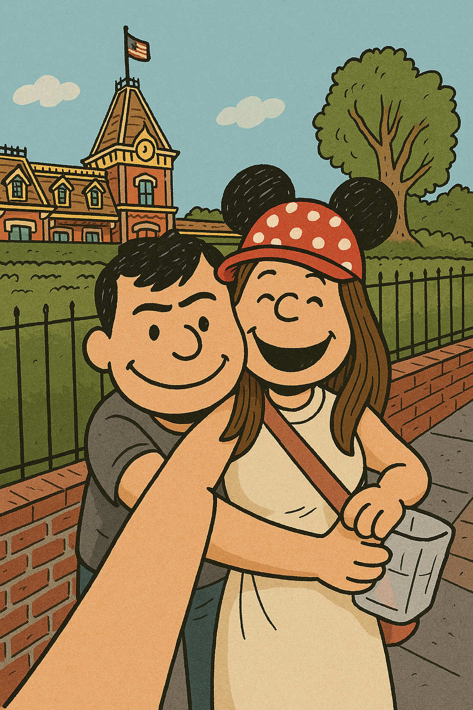

  

  

  
To Linh

  
Open

  
  

    

      

        
      

      <h1 class="question-text">Will you be my Valentine?</h1>
      
      

        

          

          Yes
        

        

          

            

            No
          

        

      

    

    

        <h1 style="font-family: 'Dancing Script', cursive; color: var(--wax-seal); font-size: 2.2rem; margin:0;">YAY! 🥰</h1>
        
I love you my pookie bear soulmate!! Always and forever!

        
    

  

  

